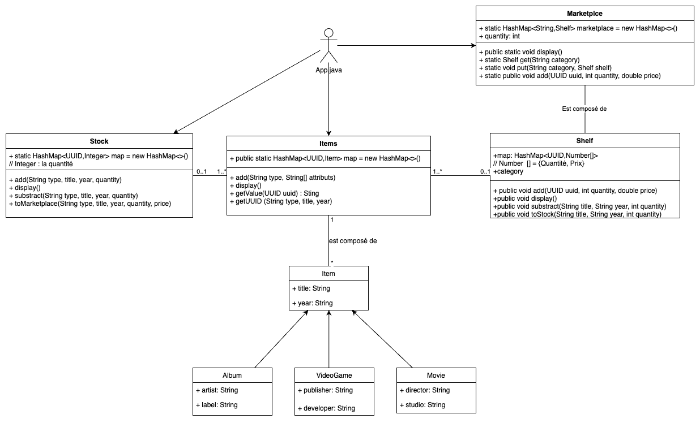
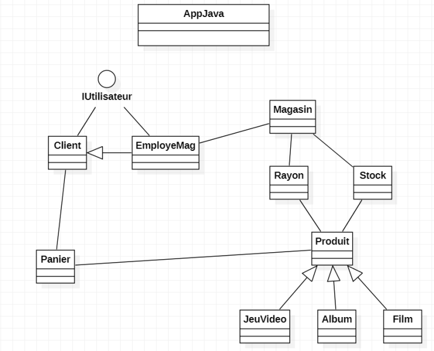

# Projet Java-Objet | Gestion d'un magazin
_**Nicolas Martinet, Valentin Réault, Mohamed Larinouna**_


## Première modélisation



Le code se trouve dans `src/main/java`.
Composé de :
- [La classe App.java](src/main/java/App.java) `src/main/java/App.java`
- [Le dossier Gestionnary](src/main/java/Gestionnary) `src/main/java/Gestionnary`
- [Le dossier Item](src/main/java/Item) `src/main/java/Item`

Celle-ci ne prends pas encore en compte la gestion des rayons et de differents magazins
Aussi la notion d'utilisateur (vendeur, responsable) n'est pas encore programmé

## Utilisation avec .jar

Pour lancer le programme, executer avec le terminal la commande ( dans le directory de la racine du projet)
```
java -jar JavaProject.jar
```


## Utilisation avec App.java

### Ajouter un article

```
Items.add("album", new String[]{"Dark Side of the Moon", "1988", "Pink Floyd", "Universal"});
Items.add("movie", new String[]{"Star Wars","2010","George Lucas","Lucasfilm"});
```

### Ajouter aux stock des article crées

Ici on propose d'ajouter 50 articles :

```
Stock.add("album", "Dark Side of the Moon","1988", 50)
```

### Afficher les article

```
Items.display();
Stock.display();
```


### Mettre en vente un article qui se trouve dans les stocks

Ici mets en vente `5` albums `Dark Side of the Moon` à `9.99`€
```
Stock.toMarketplace("albums", "Dark Side of the Moon", "2010", 10, 9.99);
```

Ici on ajoute `2` albums `Dark Side of the Moon` au meme prix (Comportement du programme non encore défini si le prix est différent
```
Stock.toMarketplace("albums", "Dark Side of the Moon", "2010", 2, 9.99);
```

## Prochaine modelisation



1. Etape en cours de réalisation : construction d'un Shell pour que le responsable du magazin puisse interagir avec le programme de facon plus intuitive (Command Line Interface)
2. Ajouter la notion d'utilisateur et de panier
3. À determiner
